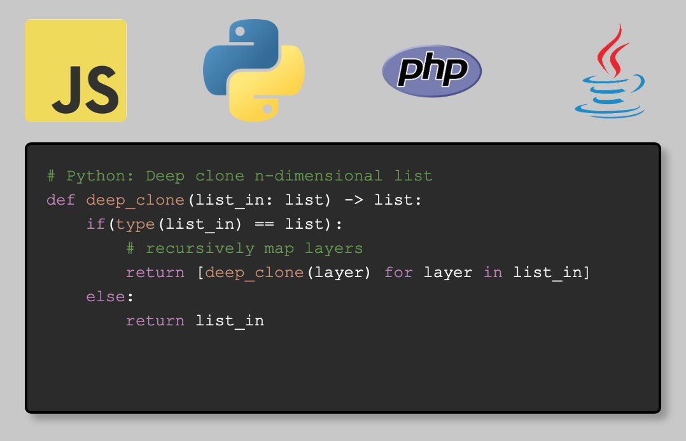

# Code Window

A mini-app to take marked-up code in various languages and write inside a browser window with a typing animation, colouring keywords on the fly. 

It is driven by Javascript (codeWindow.js) but uses CSS styling (style.css) to apply styles according to class names given in span tags.

It is programming-language-agnostic but requires input string to contain span tags with classnames according to how you want it marked up. 

Only controlled html elements are appended to the DOM (span and br tags), with everything else appended as child text nodes. However, from a security point of view, the current version only takes pre-defined input strings and is not yet intended to be safely used with user-defined input. 

